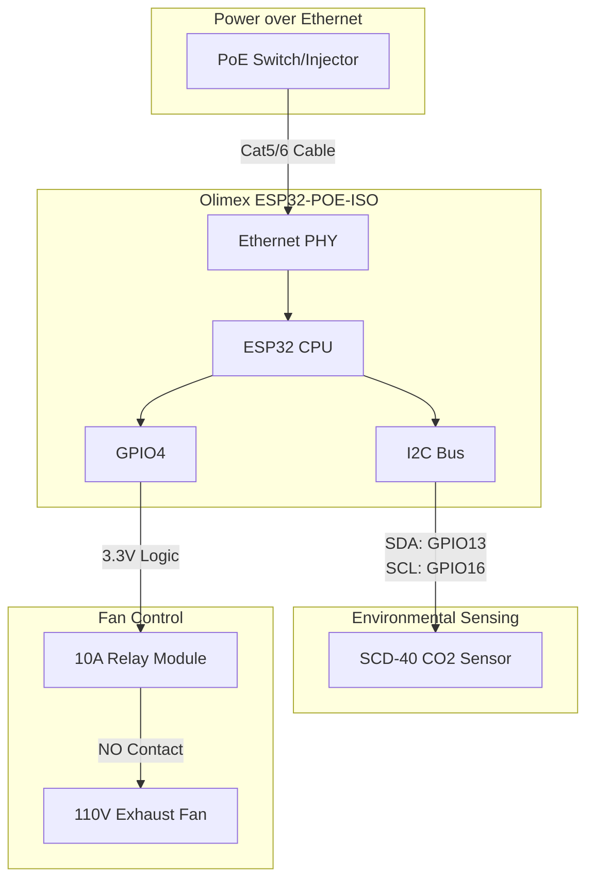
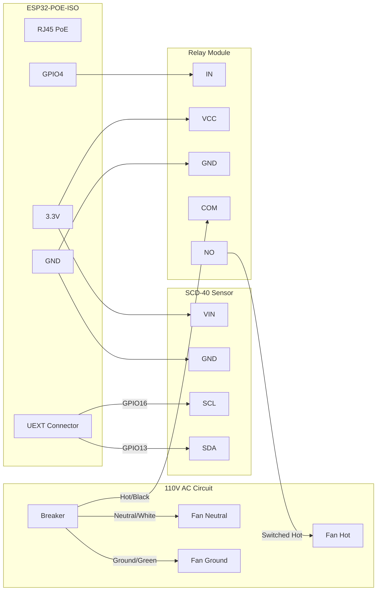
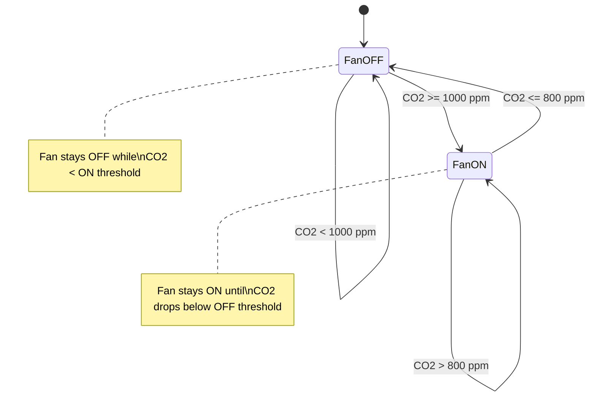

# CO2 Fan Controller with PoE

A smart ventilation controller that monitors CO2 levels and automatically activates a 110V exhaust fan when air quality drops. Single-cable PoE deployment for clean installation.

## Features

- **True CO2 Sensing**: Adafruit SCD-40 photoacoustic sensor (not VOC approximation)
- **Single Cable Deployment**: Power over Ethernet eliminates separate power runs
- **Configurable Thresholds**: Set ON/OFF levels via web interface (with hysteresis)
- **Web Dashboard**: Real-time monitoring and control from any browser
- **Home Assistant Ready**: ESPHome integration for smart home control
- **Tailnet/WireGuard Support**: Secure remote access via Tailscale subnet routing
- **Manual Override**: Toggle fan manually when needed
- **Persistent Config**: Settings survive reboots

## Bill of Materials

| Qty | Component | Part Number | Price | Source |
|-----|-----------|-------------|-------|--------|
| 1 | Olimex ESP32-POE-ISO | ESP32-POE-ISO | ~$28 | Olimex, Mouser, DigiKey |
| 1 | Adafruit SCD-40 CO2 Sensor | #5187 | ~$49 | Adafruit |
| 1 | STEMMA QT Cable 100mm | #4210 | ~$1 | Adafruit |
| 1 | 10A Relay Module (5V/3.3V) | Various | ~$5 | Amazon, AliExpress |
| 1 | Project Enclosure | Various | ~$10 | Amazon |
| 1 | PoE Switch or Injector | 802.3af | ~$20+ | Amazon |
| - | 14 AWG Wire (for 110V) | - | ~$5 | Home Depot |
| - | Wire Nuts / Connectors | - | ~$5 | Home Depot |

**Total: ~$125**

### Component Notes

**ESP32-POE-ISO vs ESP32-POE**: The ISO version has galvanic isolation between the PoE power and the board. This is recommended when working with 110V AC nearby.

**Relay Module**: Get one rated for 10A @ 120VAC minimum. Look for:
- Optocoupler isolation
- 3.3V or 5V logic trigger (ESP32-POE provides both)
- Screw terminals for AC wiring

**PoE Switch**: Any 802.3af (PoE) or 802.3at (PoE+) switch will work. The ESP32-POE-ISO draws about 3W.

## System Architecture



## Wiring Diagram



### Pin Reference

| ESP32-POE-ISO | Function | Connection |
|---------------|----------|------------|
| GPIO13 | I2C SDA | SCD-40 SDA (Blue) |
| GPIO16 | I2C SCL | SCD-40 SCL (Yellow) |
| GPIO4 | Relay Control | Relay IN |
| 3.3V | Power | SCD-40 VIN, Relay VCC |
| GND | Ground | SCD-40 GND, Relay GND |

### UEXT Connector Pinout

| Pin | Function | Pin | Function |
|-----|----------|-----|----------|
| 1 | 3.3V | 2 | GND |
| 3 | TXD | 4 | RXD |
| 5 | SCL (GPIO16) | 6 | SDA (GPIO13) |
| 7 | MISO | 8 | MOSI |
| 9 | SCK | 10 | CS |

## Important Safety Warnings

**DANGER: 110V AC CAN KILL**

1. **Turn off the breaker** before any AC wiring
2. **Use proper gauge wire** - 14 AWG for 15A circuits, 12 AWG for 20A
3. **Use an appropriate enclosure** - NEMA rated for the environment
4. **Install GFCI protection** if in a wet location
5. **Have a licensed electrician** verify your work if unsure
6. The relay should be rated for **at least 10A @ 120VAC**
7. Keep low-voltage (sensor, MCU) and high-voltage (relay contacts) separated in the enclosure

## Software Installation

### Option 1: ESPHome (Recommended)

Best for Home Assistant users or those wanting easy OTA updates.

1. Install ESPHome:
   ```bash
   pip install esphome
   ```

2. Copy the configuration:
   ```bash
   cd esphome/
   cp secrets.yaml.template secrets.yaml
   # Edit secrets.yaml with your passwords
   ```

3. Flash the device (first time via USB):
   ```bash
   esphome run co2-fan-controller.yaml
   ```

4. Future updates happen over the network automatically.

### Option 2: Arduino IDE

For standalone operation without Home Assistant.

1. Install Arduino IDE 2.x

2. Add ESP32 board support:
   - File -> Preferences -> Additional Board URLs:
   - Add: `https://raw.githubusercontent.com/espressif/arduino-esp32/gh-pages/package_esp32_index.json`

3. Install required libraries (Tools -> Library Manager):
   - `Sensirion I2C SCD4x`
   - `ArduinoJson`

4. Select board: `ESP32 Dev Module` or `Olimex ESP32-POE-ISO`

5. Open `arduino/co2_fan_controller/co2_fan_controller.ino`

6. Upload via USB (disconnect PoE first if using non-ISO version!)

## Configuration

### Tailnet / Remote Access

The ESPHome firmware includes WireGuard support for connecting to your Tailscale network. This allows secure access from anywhere without port forwarding.

**Quick Setup:**
1. Set up a Tailscale subnet router (any Linux box on your tailnet)
2. Configure WireGuard on the subnet router to bridge to 10.13.13.0/24
3. Add the WireGuard keys to `secrets.yaml`
4. Access your CO2 controller from anywhere on your tailnet

See `docs/TAILNET_SETUP.md` for detailed instructions.

### Default Thresholds

| Setting | Default | Description |
|---------|---------|-------------|
| CO2 ON Threshold | 1000 ppm | Fan turns ON above this level |
| CO2 OFF Threshold | 800 ppm | Fan turns OFF below this level |
| Measurement Interval | 30 sec | How often to check CO2 |

### CO2 Level Guidelines

| Level (ppm) | Quality | Action |
|-------------|---------|--------|
| 400-600 | Excellent | Outdoor air level |
| 600-800 | Good | Well-ventilated indoor |
| 800-1000 | Moderate | Start ventilating |
| 1000-1500 | Poor | Active ventilation needed |
| 1500+ | Bad | Immediate ventilation |

### Hysteresis Explained

The ON/OFF thresholds create hysteresis to prevent rapid cycling:



- Fan turns **ON** when CO2 rises above ON threshold (1000 ppm)
- Fan stays **ON** until CO2 drops below OFF threshold (800 ppm)
- This 200 ppm gap prevents the fan from toggling every few seconds

## Web Interface

Once running, access the device at its IP address (shown in serial monitor on boot):

```
http://192.168.x.x/
```

**Endpoints:**
- `GET /` - Web dashboard
- `GET /api/status` - JSON status
- `POST /api/config` - Update thresholds
- `POST /api/fan` - Manual fan control

## Troubleshooting

### No Ethernet Connection

1. Verify PoE switch/injector is 802.3af compliant
2. Check the cable is good (try a different one)
3. Look for link lights on the RJ45 jack
4. Serial monitor shows `[ETH] Got IP: x.x.x.x` on success

### Sensor Not Found

1. Verify I2C wiring (SDA to GPIO13, SCL to GPIO16)
2. Check 3.3V power to sensor
3. Run I2C scanner to verify address 0x62

### Fan Not Switching

1. Verify relay module gets proper voltage (3.3V or 5V)
2. Check GPIO4 connection to relay IN
3. Test relay manually: `http://device-ip/api/fan?state=on`
4. Verify relay contacts are rated for your load

### Inaccurate CO2 Readings

1. Allow 2+ hours for sensor warm-up on first power-on
2. Expose to fresh outdoor air weekly for auto-calibration
3. Don't mount directly in airflow from fan
4. Keep away from CO2 sources (people breathing directly on it)

## Project Structure

```
co2-fan-controller/
├── esphome/
│   ├── co2-fan-controller.yaml    # ESPHome configuration
│   └── secrets.yaml.template       # Credentials template
├── arduino/
│   └── co2_fan_controller/
│       └── co2_fan_controller.ino  # Arduino firmware
├── docs/
│   ├── QUICK_REFERENCE.txt         # Printable wiring card
│   └── TAILNET_SETUP.md            # Tailscale/WireGuard setup
└── README.md
```

## License

GNU General Public License v3.0

## Author

Mike Morris - Quick SCIF LLC
